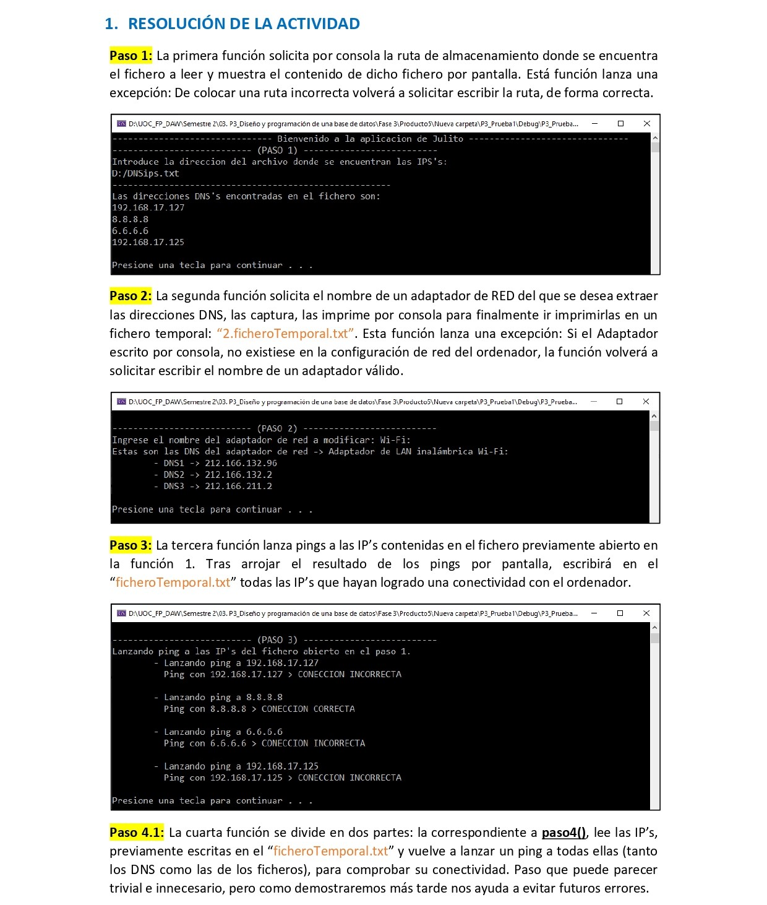
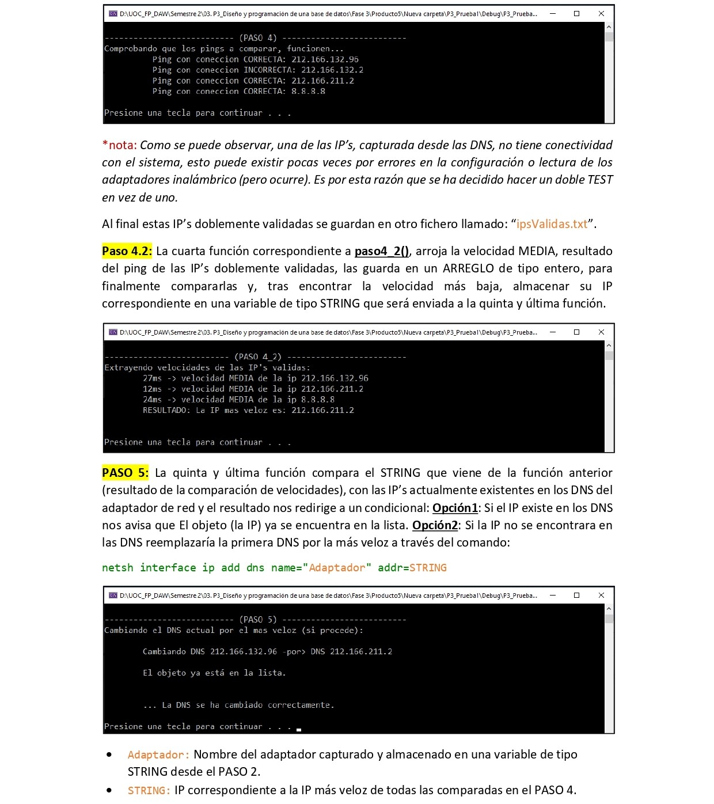

# Comandos personalizados de windows shell con C
El presente es mi primer proyecto en el múndo de la programación. Es una pequeña aplicación, desarrollada en lenguaje C, que es capaz de modificar la configuración de red de una máquina local, cambiando el DNS actual del ordenador, por uno más rápido que será determinado entre una lista de diferentes servidores DNS escritos en un fichero de texto. 

Nota: Para hacer uso de está aplicación se requieren permisos de administración.

<ul>
  <li><h4 style="font-weight: bold;">Video resolución del proyecto:</h4></li> 
  
https://www.youtube.com/playlist?list=PL4f2y_lbxmN_n4WzLHgZiX33qOt3d7Jyd

  <li><h4 style="font-weight: bold;">Resolución del proyecto:</h4></li>
</ul>

