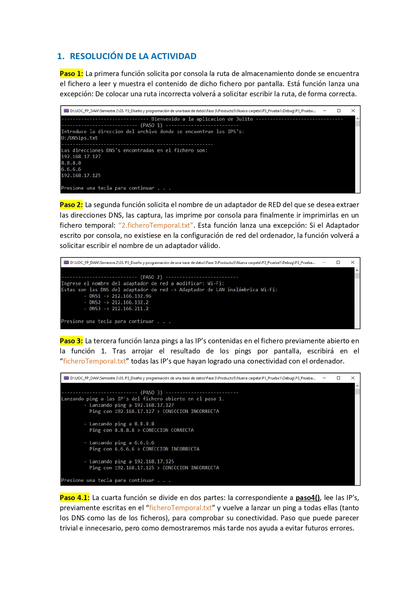
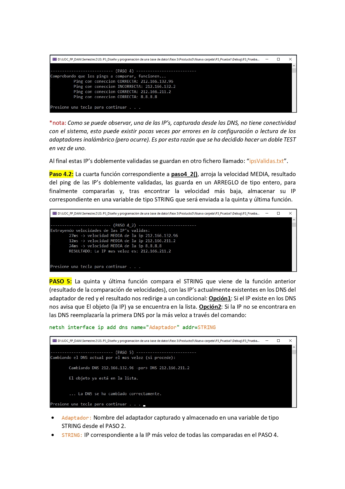

# Comandos personalizados con C
La siguiente, es una pequeña aplicación, desarrollada en lenguaje C, que es capaz de modificar parte de la configuración de red de una máquina local (únicamente en lo que tiene que ver con la resolución de nombres de dominio), por un adaptador que se determinará entre los de una lista de servidores DNS escritos en un fichero de texto, en caso de que el servidor DNS actual no sea el más rápido entre los proporcionado.

**Video resolución del proyecto:** 
https://www.youtube.com/playlist?list=PL4f2y_lbxmN_n4WzLHgZiX33qOt3d7Jyd

**Resolución del proyecto:**

